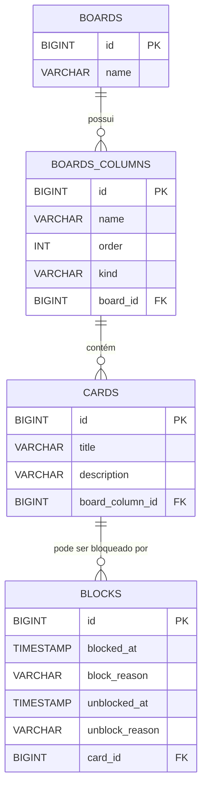

# Board de Tarefas - Desafio de Projeto Santander Backend com Java


## 📖 Descrição

Este projeto é uma aplicação de console para gerenciamento de tarefas, similar a um Kanban Board como Trello ou Jira. Desenvolvido como parte do Desafio de Projeto do bootcamp **Santander Backend com Java**, da Digital Innovation One, o sistema permite a criação e gerenciamento de múltiplos boards, colunas e cards de tarefas.

A aplicação foi construída em Java puro, sem o uso de frameworks como Spring, focando nos fundamentos de JDBC, arquitetura em camadas e gerenciamento de banco de dados com Liquibase.

## ✨ Funcionalidades

- **Gerenciamento de Boards:** Criar, selecionar e excluir boards.
- **Gerenciamento de Cards:** Criar, mover, bloquear, desbloquear e cancelar cards.
- **Visualização:**
  - Ver detalhes de um board, com o status de suas colunas.
  - Listar todos os cards dentro de uma coluna específica.
  - Exibir informações detalhadas de um card, incluindo histórico de bloqueios.
- **Persistência de Dados:** Todas as informações são salvas em um banco de dados MySQL.
- **Migrações de Banco de Dados:** O schema do banco de dados é totalmente gerenciado pelo Liquibase, garantindo consistência e versionamento.

## 🛠️ Tecnologias Utilizadas

- **Linguagem:** Java 17
- **Build Tool:** Gradle
- **Banco de Dados:** MySQL
- **Gerenciador de Migrações:** Liquibase
- **Utilitários:** Lombok

## ⚙️ Pré-requisitos

Antes de começar, você vai precisar ter instalado em sua máquina:
- [Java JDK 17](https://www.oracle.com/java/technologies/javase/jdk17-archive-downloads.html) ou superior.
- [MySQL Server 8.0](https://dev.mysql.com/downloads/mysql/) ou superior.
- Uma IDE de sua preferência (IntelliJ, VS Code, Eclipse).

## 🚀 Executando o Projeto

1. **Clone o repositório:**
   ```sh
   git clone <url-do-seu-repositorio>
   ```

2. **Configure o Banco de Dados:**
   - Conecte-se ao seu MySQL como usuário `root`.
   - Crie o banco de dados e o usuário que a aplicação irá utilizar.

   ```sql
   CREATE DATABASE board;
   CREATE USER 'board'@'localhost' IDENTIFIED BY 'board';
   GRANT ALL PRIVILEGES ON board.* TO 'board'@'localhost';
   FLUSH PRIVILEGES;
   ```

3. **Execute a Aplicação:**
   - Abra o projeto na sua IDE.
   - Execute a classe `Main.java`.
   - Na primeira execução, o Liquibase irá rodar automaticamente e criar todas as tabelas necessárias no banco de dados. Em seguida, o menu interativo aparecerá no console.

## 🏛️ Arquitetura

O projeto segue uma arquitetura em camadas para separar as responsabilidades:

- **UI (Interface do Usuário):** Camada responsável pela interação com o usuário via console.
- **Service (Serviços):** Camada que contém a lógica de negócio da aplicação.
- **Persistence (Persistência):** Camada responsável pelo acesso e manipulação dos dados no banco de dados, utilizando o padrão DAO (Data Access Object).
- **DTOs e Entities:** Objetos para transferência de dados e representação das tabelas do banco.


## 🗃️ Schema do Banco de Dados

O relacionamento entre as principais entidades do banco de dados é mostrado abaixo:


